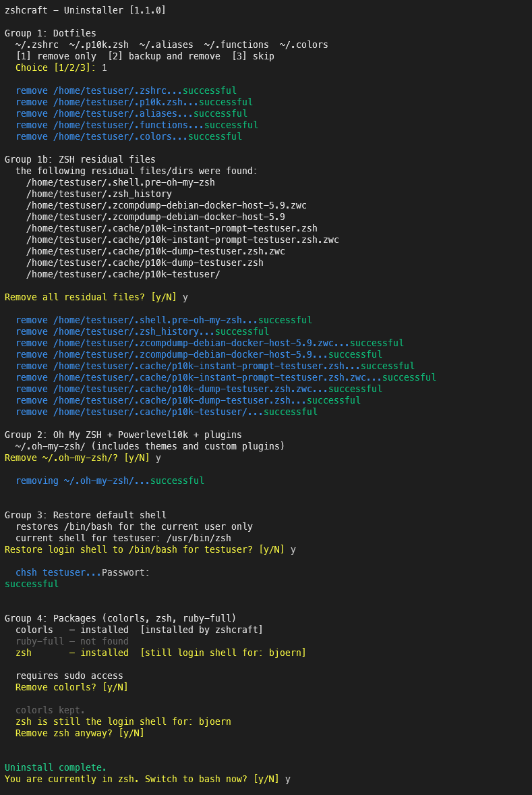

# zshcraft — zsh + Oh My ZSH! + Powerlevel10k + plugins + aliases + functions

[](https://opensource.org/licenses/MIT)
[](https://www.gnu.org/software/bash/)
[](https://ohmyz.sh/)
[](https://github.com/techno-artisan/zsh-craft/stargazers)
[](https://github.com/techno-artisan/zsh-craft/releases)

A shell setup installer that bootstraps a new Linux/macOS/Windows (Cygwin/MinGW) server or workstation with a fully configured ZSH environment.


### Background ###

Managing multiple Linux servers meant constantly switching between terminals that looked and behaved differently — no consistent prompt, no shared aliases, no unified workflow. The goal was a single installer that could be dropped onto any machine and produce the same polished, productive shell environment every time.

The initial inspiration came from this article: [Oh My ZSH! + Powerlevel10k = Cool Terminal](https://dev.to/abdfnx/oh-my-zsh-powerlevel10k-cool-terminal-1no0) — **zshcraft** takes that idea further by automating the full setup and adapting it to multiple platforms and package managers.

### What is this repository for? ###

**zshcraft** is a one-shot installer that sets up a complete, opinionated ZSH environment. It installs and configures:

- **[Oh My ZSH!](https://ohmyz.sh/)** — ZSH framework
- **[Powerlevel10k](https://github.com/romkatv/powerlevel10k)** — fast, feature-rich prompt theme
- **Plugins:** `zsh-autosuggestions`, `zsh-syntax-highlighting`, `alias-finder`, `git`, `python`, `pip`, `docker`, `sudo`
- **Pre-configured dotfiles** copied to `$HOME`: `.zshrc`, `.p10k.zsh`, `.aliases`, `.functions`, `.colors`

Alias and function sets are assembled automatically based on the detected OS and package manager (APT, YUM, APK, Pacman). Raspberry Pi is detected and gets an additional alias set. macOS gets the `osx` plugin added automatically.

### How do I get set up? ###

**Requirements:** bash >= 4, `curl`, `git`, `sudo` access, internet connection

> **Note:** Powerlevel10k and colorls use icons that require a **[Nerd Font](https://www.nerdfonts.com/)** in your terminal emulator. Without it, icons will appear as `?` or broken characters. Recommended: [MesloLGS NF](https://github.com/romkatv/powerlevel10k#fonts) (used by Powerlevel10k by default).

```bash
git clone https://github.com/techno-artisan/zsh-craft.git && cd zsh-craft && bash install.sh
```

The installer ends by exec'ing into `zsh` — your new shell is ready immediately.

#### What the installer does (step by step)

The installer is non-interactive and runs fully automated:

- Verifies bash >= 4 and that `sudo` access is available — aborts early if not
- Installs `ruby-full` and `zsh` via `apt`
- Installs `colorls` via `gem` (requires ruby-full)
- Installs **Oh My ZSH!** in unattended mode (`RUNZSH=no`) — does not auto-launch a new shell
- Clones **Powerlevel10k** into `~/.oh-my-zsh/custom/themes/`
- Clones **zsh-autosuggestions** and **zsh-syntax-highlighting** into `~/.oh-my-zsh/custom/plugins/`
- Copies pre-configured dotfiles to `$HOME`:
  - `.zshrc` — main ZSH config with plugins and theme already set up
  - `.p10k.zsh` — Powerlevel10k theme config
  - `.colors` — ANSI color variables
  - `.functions` — utility functions (installer base + global additions combined)
  - `.aliases` — alias set assembled from global + OS/package-manager-specific files
- Detects OS and package manager — appends the right alias file automatically (APT, YUM, APK, Pacman, macOS, Cygwin/MinGW)
- Detects Raspberry Pi — appends Pi-specific aliases if running on one
- On macOS: adds the `osx` plugin to `.zshrc` automatically
- Launches `zsh` via `exec zsh -l` — no manual steps needed

### Supported platforms ###

| Platform | Package managers                        | Notes                              |
|----------|-----------------------------------------|------------------------------------|
| Linux    | APT, YUM, APK, Pacman                   | Tested on Debian/Ubuntu            |
| macOS    | — (Homebrew aliases via `.aliases.osx`) |                                    |
| Windows  | Cygwin / MinGW                          |                                    |

> **Note:** The prerequisite installation (`zsh`, `ruby-full`, `colorls`) uses `apt` and `gem` and is currently only supported on Debian/Ubuntu-based systems. On other platforms, install these manually before running the installer.

### Contribution guidelines ###

* Code review
* Keep alias/function files platform-scoped

### Uninstall ###



Run the interactive uninstaller:

```bash
cd ~/zsh-craft && bash uninstall.sh
```

Use `--dry-run` to preview what will be removed without making any changes:

```bash
cd ~/zsh-craft && bash uninstall.sh --dry-run
```

#### What the uninstaller does (step by step)

The uninstaller is fully interactive — nothing is removed without your confirmation. Each group can be skipped independently.

**Group 1 — Dotfiles** (`~/.zshrc`, `~/.p10k.zsh`, `~/.aliases`, `~/.functions`, `~/.colors`)
- Choose between: remove only / backup and remove / skip
- Backups are timestamped (e.g. `~/.zshrc.bak.20260321_143000`)

**Group 1b — ZSH residual files**
- Scans for and lists files/dirs that exist before asking
- Covers: `~/.zsh_history`, `~/.shell.pre-oh-my-zsh`, `.zcompdump*` files
- Covers cache: `~/.cache/p10k-dump-*.zsh`, `~/.cache/p10k-instant-prompt-*.zsh` (incl. `.zwc` variants), `~/.cache/p10k-*/` dirs
- Single yes/no prompt to remove all found items — or skip

**Group 2 — Oh My ZSH + Powerlevel10k + plugins** (`~/.oh-my-zsh/`)
- Single yes/no prompt — removes the entire directory including all themes and custom plugins

**Group 3 — Restore login shell**
- Only shown if your current login shell is `zsh`
- Offers to restore `/bin/bash` for the current user via `chsh`
- This runs before package removal so `zsh` is still available when `chsh` runs

**Group 4 — Packages** (`colorls`, `zsh`, `ruby-full`)
- Shows package status upfront: installed / not found / pre-existing (installed before zshcraft)
- Pre-existing packages are flagged and require explicit confirmation to remove
- `zsh` is flagged if it is still the login shell of any user on the system
- Each package is asked for individually — requires `sudo`

### License ###

[MIT](https://opensource.org/licenses/MIT) © techno-artisan
