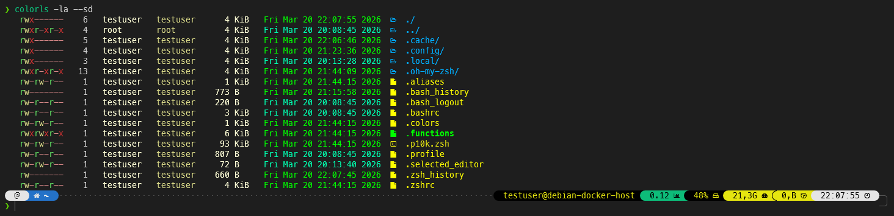

# zshcraft — zsh + Oh My ZSH! + Powerlevel10k + plugins + aliases + functions

[](https://opensource.org/licenses/MIT)
[](https://www.gnu.org/software/bash/)
[](https://ohmyz.sh/)

A shell setup installer that bootstraps a new Linux/macOS/Windows (Cygwin/MinGW) server or workstation with a fully configured ZSH environment.



### What is this repository for? ###

**zshcraft** is a one-shot installer that sets up a complete, opinionated ZSH environment. It installs and configures:

- **[Oh My ZSH!](https://ohmyz.sh/)** — ZSH framework
- **[Powerlevel10k](https://github.com/romkatv/powerlevel10k)** — fast, feature-rich prompt theme
- **Plugins:** `zsh-autosuggestions`, `zsh-syntax-highlighting`, `alias-finder`, `git`, `python`, `pip`, `docker`, `sudo`
- **Pre-configured dotfiles** copied to `$HOME`: `.zshrc`, `.p10k.zsh`, `.aliases`, `.functions`, `.colors`

Alias and function sets are assembled automatically based on the detected OS and package manager (APT, YUM, APK, Pacman). Raspberry Pi is detected and gets an additional alias set. macOS gets the `osx` plugin added automatically.

### How do I get set up? ###

**Requirements:** bash >= 4, `curl`, `git`, `sudo` access, internet connection

> **Note:** Powerlevel10k and colorls use icons that require a **[Nerd Font](https://www.nerdfonts.com/)** in your terminal emulator. Without it, icons will appear as `?` or broken characters. Recommended: [MesloLGS NF](https://github.com/romkatv/powerlevel10k#fonts) (used by Powerlevel10k by default).

```bash
git clone https://github.com/techno-artisan/zsh-craft.git && cd zsh-craft && bash install.sh
```

The installer ends by exec'ing into `zsh` — your new shell is ready immediately.

### Supported platforms ###

| Platform | Package managers                        | Notes                              |
|----------|-----------------------------------------|------------------------------------|
| Linux    | APT, YUM, APK, Pacman                   | Tested on Debian/Ubuntu            |
| macOS    | — (Homebrew aliases via `.aliases.osx`) |                                    |
| Windows  | Cygwin / MinGW                          |                                    |

> **Note:** The prerequisite installation (`zsh`, `ruby-full`, `colorls`) uses `apt` and `gem` and is currently only supported on Debian/Ubuntu-based systems. On other platforms, install these manually before running the installer.

### Contribution guidelines ###

* Code review
* Keep alias/function files platform-scoped

### Uninstall ###

There is no uninstall script. To revert manually:

```bash
rm -f ~/.zshrc ~/.p10k.zsh ~/.aliases ~/.functions ~/.colors
rm -rf ~/.oh-my-zsh
```

Optionally restore your previous shell: `chsh -s /bin/bash`

### License ###

[MIT](https://opensource.org/licenses/MIT) © techno-artisan
